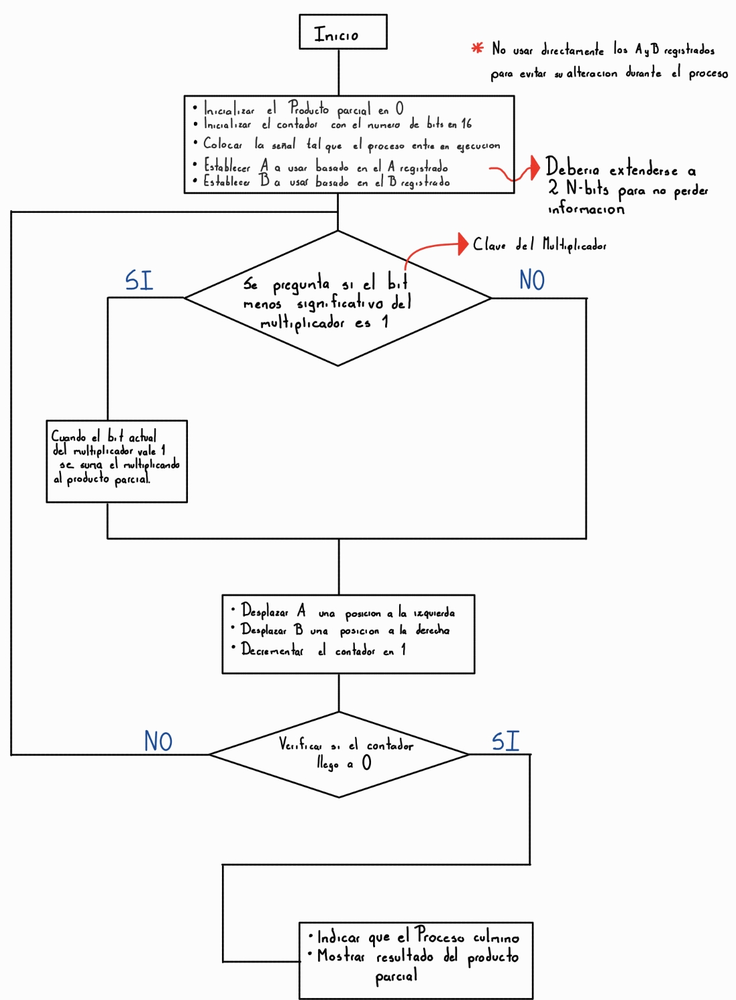
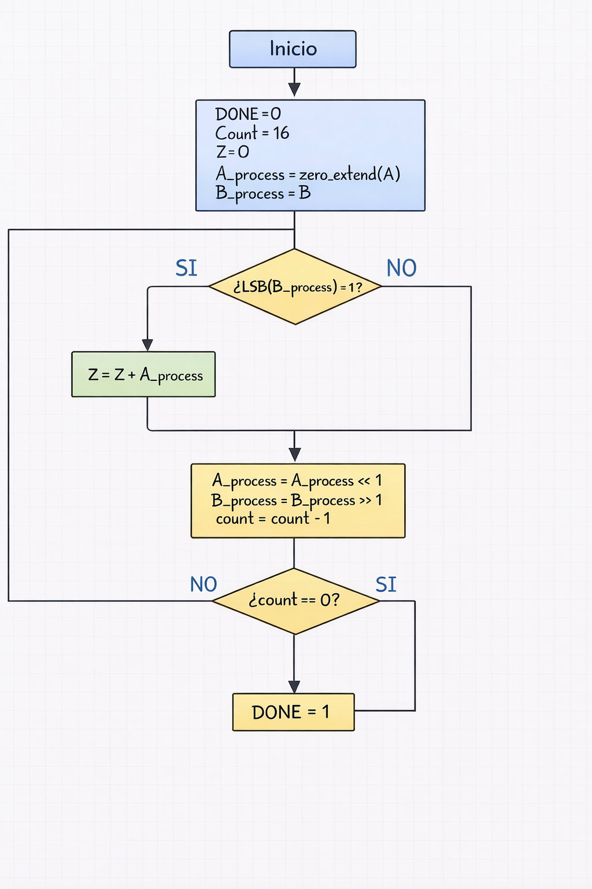

## 📘 Introducción

Este módulo implementa un multiplicador binario secuencial basado en el algoritmo de productos parciales. El diseño sigue el enfoque trabajado en clase, donde primero se define el funcionamiento del algoritmo de manera conceptual y luego se traduce a una estructura más cercana a la implementación en Verilog, separando claramente el comportamiento lógico del sistema y su arquitectura final.

---

# 📊 1. Diagrama Algorítmico

Este primer diagrama representa el funcionamiento del algoritmo de manera escrita y secuencial. En él se describe paso a paso cómo se realiza la multiplicación binaria, comenzando con la inicialización del acumulador, la verificación del bit menos significativo del multiplicador y la ejecución de los corrimientos correspondientes.

Este esquema permite entender claramente cómo debe comportarse el sistema antes de implementarlo en código, e incluye los puntos clave discutidos en clase.

---

# 🏗 2. Diagrama Definitivo del Sistema

Este segundo diagrama representa la versión estructurada del sistema, ya muy cercana a la implementación final en código Verilog.

A continuación se describe el significado de las principales señales y elementos del diagrama:

- **A_process**: Registro que almacena el multiplicando y se desplaza a la izquierda en cada iteración.
- **B_process**: Registro que almacena el multiplicador y se desplaza a la derecha para evaluar el bit menos significativo.
- **Z**: Acumulador donde se almacenan los productos parciales. Contiene el resultado final de la multiplicación.
- **count**: Contador que controla el número de iteraciones del algoritmo.
- **LSB(B_process)**: Bit menos significativo del multiplicador, utilizado para decidir si se realiza la suma parcial.
- **DONE**: Señal que indica que el proceso de multiplicación ha finalizado y que el resultado está disponible.
- **<< 1**: Operación de corrimiento lógico a la izquierda.
- **>> 1**: Operación de corrimiento lógico a la derecha.

Este diagrama ya refleja directamente la estructura que posteriormente será implementada en el módulo en Verilog.

---

## 🧪 Ejemplo de Funcionamiento (formato del diagrama)  
### Multiplicación: 1111 × 1010

Se toma:

- A = 1111₂
- B = 1010₂

Inicialización del sistema:

- DONE = 0
- count = 16
- Z = 00000000000000000000000000000000
- A_process = 00000000000000000000000000001111   (zero_extend de A)
- B_process = 0000000000001010

---

### 🔁 Iteración 1

LSB(B_process) = 0  

No se realiza suma.

Corrimientos:
- A_process = A_process << 1 → 00000000000000000000000000011110
- B_process = B_process >> 1 → 0000000000000101
- count = 15

Z permanece:
- Z = 00000000000000000000000000000000

---

### 🔁 Iteración 2

LSB(B_process) = 1  

Se realiza suma:
- Z = Z + A_process
- Z = 00000000000000000000000000000000 + 00000000000000000000000000011110
- Z = 00000000000000000000000000011110

Corrimientos:
- A_process = A_process << 1 → 00000000000000000000000000111100
- B_process = B_process >> 1 → 0000000000000010
- count = 14

---

### 🔁 Iteración 3

LSB(B_process) = 0  

No se realiza suma.

Corrimientos:
- A_process = A_process << 1 → 00000000000000000000000001111000
- B_process = B_process >> 1 → 0000000000000001
- count = 13

Z permanece:
- Z = 00000000000000000000000000011110

---

### 🔁 Iteración 4

LSB(B_process) = 1  

Se realiza suma:
- Z = Z + A_process
- Z = 00000000000000000000000000011110 + 00000000000000000000000001111000
- Z = 00000000000000000000000010010110

Corrimientos:
- A_process = A_process << 1 → 00000000000000000000000011110000
- B_process = B_process >> 1 → 0000000000000000
- count = 12

---

### 🔁 Iteraciones 5 a 16 (B_process ya es 0)

Como B_process = 0, entonces:
- LSB(B_process) = 0 en todas las iteraciones restantes
- No se realizan más sumas
- Solo continúan los corrimientos y el decremento de count

Z se mantiene constante:
- Z = 00000000000000000000000010010110

count sigue bajando:
- 12 → 11 → 10 → ... → 0

---

### ✅ Finalización

count == 0  

- DONE = 1
- Resultado final en Z:

Z = 00000000000000000000000010010110₂

(En 8 bits: 10010110₂)  
Equivalente en decimal: 15 × 10 = 150

