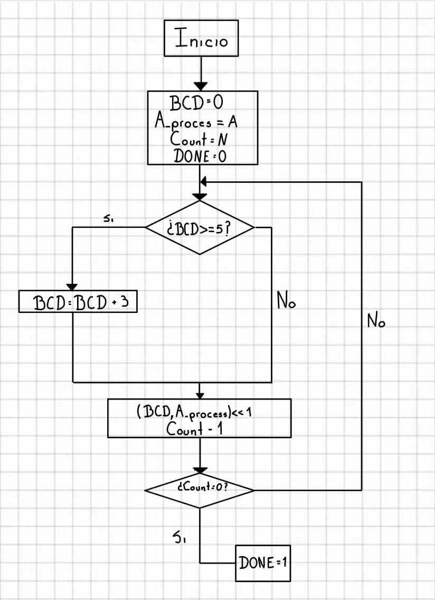
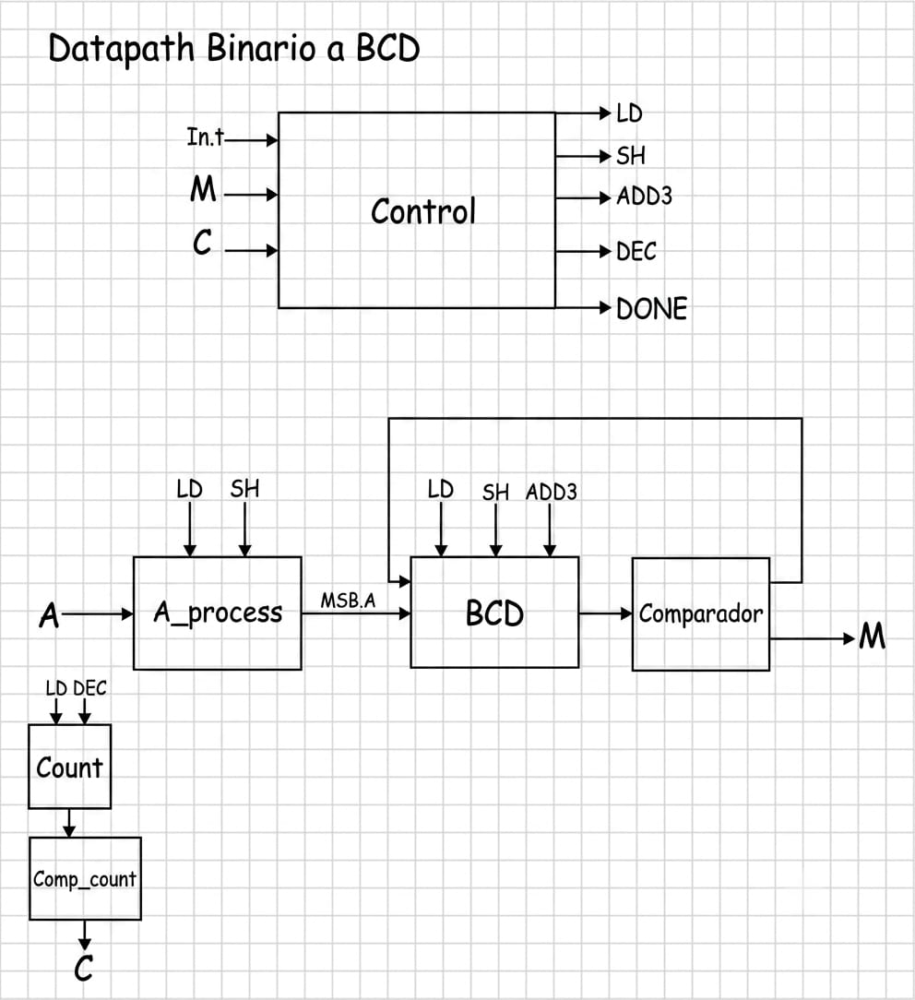
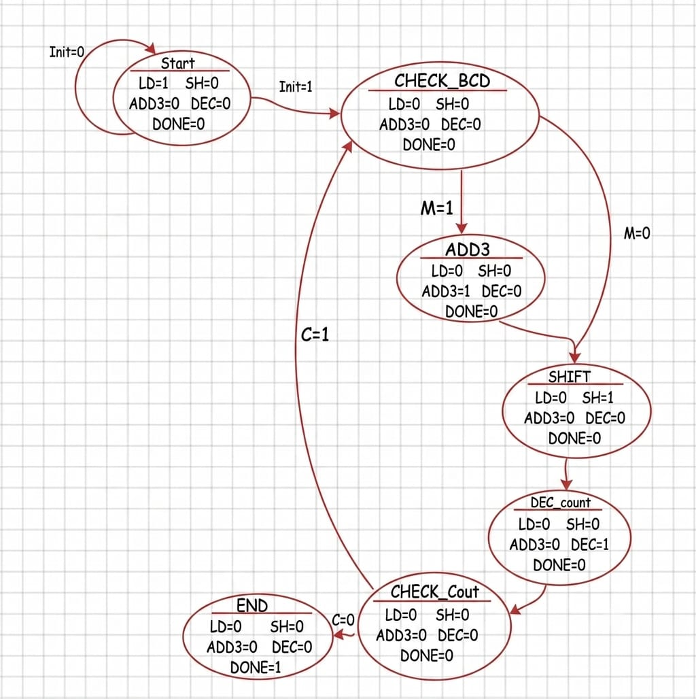

# 🔢 Binario a BCD

[⬅ Volver a Calculadora](../../../README_Calculadora.md) · [🏠 Volver al README principal](../../../../README.md)

## 📘 Descripción general

Este módulo convierte un número binario sin signo de 32 bits a una representación decimal codificada en BCD mediante el algoritmo **Double Dabble**, también conocido como **Shift-Add-3**.

El resultado se entrega en un bus de 32 bits formado por ocho dígitos BCD:

```text
BCD = {D7, D6, D5, D4, D3, D2, D1, D0}
```

Cada dígito ocupa cuatro bits. Por esta razón, el rango decimal previsto por el diseño es:

```text
0 a 99 999 999
```

Por ejemplo:

```text
Entrada decimal: 20 102 238
Salida BCD:      0x20102238
```

La conversión procesa los 32 bits de la entrada, uno por uno, mediante una máquina de estados.

---

## 📂 Ubicación de los archivos

```text
Calculadora/
├── Diagramas/
│   └── Diagramas_BinarioBCD/
│       ├── Diagramas_BinarioBCD_Flujo.png
│       ├── Diagramas_BinarioBCD_Datapath.png
│       └── Diagramas_BinarioBCD_Estados.png
│
├── Fimware/
│   └── asm/
│       └── BinarioBCD.S
│
└── rtl/
    └── Cores/
        └── Binario_BCD/
            ├── A_process_BinarioBCD.v
            ├── BCD.v
            ├── Comparador_BCD.v
            ├── Comp_count_BinarioBCD.v
            ├── Control_BinarioBCD.v
            ├── Count_BinarioBCD.v
            ├── Periferico_BinarioBCD.v
            ├── Testbench_BinarioBCD.v
            ├── Testbench_Periferico_BinarioBCD.v
            ├── TOP_BinarioBCD.v
            └── README.md
```

---

## ⚙️ Funcionamiento

El algoritmo Double Dabble convierte el número binario mediante correcciones y corrimientos sucesivos.

1. Se carga el número binario en `A_process`.
2. El registro `BCD` se inicializa en cero.
3. El contador se carga con el valor 32.
4. Se revisan los ocho dígitos BCD.
5. Cada dígito mayor o igual a cinco se marca para corrección.
6. A cada dígito marcado se le suma tres.
7. El registro BCD se desplaza una posición a la izquierda.
8. El bit más significativo de `A_process` entra por el bit menos significativo del registro BCD.
9. `A_process` también se desplaza una posición a la izquierda.
10. El contador disminuye una unidad.
11. El procedimiento se repite hasta procesar los 32 bits.
12. La señal `DONE` indica que la conversión terminó.

La corrección mediante `+3` garantiza que, después del corrimiento, cada grupo de cuatro bits conserve una representación decimal válida.

---

## 🧭 Diagramas

### Diagrama de flujo

<p align="center">
  
</p>

### Datapath

<p align="center">
  
</p>

### Diagrama de estados

<p align="center">
  
</p>

---

## 🔌 Interfaz del módulo TOP

El módulo principal es `TOP_BinarioBCD.v`.

| Señal | Dirección | Bits | Descripción |
|---|---:|---:|---|
| `clk` | Entrada | 1 | Señal de reloj del sistema. |
| `reset` | Entrada | 1 | Reinicia la unidad de control. |
| `init` | Entrada | 1 | Solicita el inicio de la conversión. |
| `A` | Entrada | 32 | Número binario sin signo. |
| `BCD` | Salida | 32 | Resultado formado por ocho dígitos BCD. |
| `DONE` | Salida | 1 | Indica que la conversión terminó. |

---

## 🧩 Camino de datos

El camino de datos está formado por cinco bloques principales.

| Módulo | Función |
|---|---|
| `A_process_BinarioBCD.v` | Almacena el número binario y lo desplaza hacia la izquierda. |
| `BCD.v` | Almacena el resultado, realiza las correcciones `+3` y recibe los bits del número binario. |
| `Comparador_BCD.v` | Revisa individualmente los ocho dígitos BCD. |
| `Count_BinarioBCD.v` | Cuenta las 32 iteraciones del algoritmo. |
| `Comp_count_BinarioBCD.v` | Indica si todavía quedan bits por procesar. |

### Registro de entrada

`A_process_BinarioBCD` carga el número de entrada cuando `LD = 1`:

```text
A_out = A
```

Su bit más significativo se entrega mediante:

```text
MSB_A = A_out[31]
```

Cuando `SH = 1`, el registro se desplaza hacia la izquierda:

```text
A_out = A_out << 1
```

Así, en cada iteración se presenta un nuevo bit en `MSB_A`.

### Registro BCD

El módulo `BCD` contiene ocho dígitos de cuatro bits.

Cuando `LD = 1`:

```text
BCD_out = 0
```

Cuando `ADD3 = 1`, revisa el vector `M_digit`. Cada bit de este vector corresponde a uno de los ocho dígitos:

```text
M_digit[0] → BCD_out[3:0]
M_digit[1] → BCD_out[7:4]
M_digit[2] → BCD_out[11:8]
M_digit[3] → BCD_out[15:12]
M_digit[4] → BCD_out[19:16]
M_digit[5] → BCD_out[23:20]
M_digit[6] → BCD_out[27:24]
M_digit[7] → BCD_out[31:28]
```

Si un bit de `M_digit` vale `1`, al dígito correspondiente se le suma tres.

Cuando `SH = 1`, el registro completo se desplaza e incorpora `MSB_A`:

```text
BCD_out = {BCD_out[30:0], MSB_A}
```

### Comparador de dígitos

`Comparador_BCD` evalúa los ocho dígitos de manera combinacional.

Para cada dígito se comprueba:

```text
dígito > 4
```

Esto equivale a verificar si el valor es mayor o igual a cinco.

La salida `M_digit[7:0]` identifica cuáles dígitos requieren corrección. La señal global:

```text
M = |M_digit
```

vale `1` cuando al menos un dígito necesita la operación `+3`.

### Contador

`Count_BinarioBCD` se carga con 32:

```text
count = 32
```

Cuando `DEC = 1`:

```text
count = count - 1
```

`Comp_count_BinarioBCD` genera:

```text
C = 1, cuando count != 0
C = 0, cuando count == 0
```

---

## 🎛️ Señales de control y estado

| Señal | Tipo | Función |
|---|---|---|
| `LD` | Control | Carga el número binario, limpia el registro BCD e inicializa el contador. |
| `SH` | Control | Desplaza `A_process` y el registro BCD. |
| `ADD3` | Control | Suma tres a los dígitos indicados por `M_digit`. |
| `DEC` | Control | Disminuye el contador. |
| `MSB_A` | Datos | Bit del número binario que entra al registro BCD. |
| `M_digit` | Estado | Indica cuáles dígitos BCD son mayores o iguales a cinco. |
| `M` | Estado | Indica que al menos un dígito requiere corrección. |
| `C` | Estado | Indica que aún quedan bits por procesar. |
| `DONE` | Salida | Indica que el resultado BCD está disponible. |

---

## 🔄 Unidad de control

`Control_BinarioBCD.v` implementa siete estados.

| Estado | Operación |
|---|---|
| `START` | Activa `LD`, inicializa el camino de datos y espera `init = 1`. |
| `CHECK_BCD` | Revisa la señal `M` para determinar si se requiere corrección. |
| `ADD3_STATE` | Activa `ADD3` para corregir los dígitos marcados. |
| `SHIFT` | Activa `SH` para desplazar los registros. |
| `DEC_COUNT` | Activa `DEC` para disminuir el contador. |
| `CHECK_COUNT` | Revisa si aún quedan bits por procesar. |
| `END_STATE` | Activa `DONE` y luego regresa al estado inicial. |

La secuencia general es:

```text
START
  │ init = 1
  ▼
CHECK_BCD
  ├── M = 1 ─→ ADD3_STATE ─┐
  └── M = 0 ───────────────┤
                            ▼
                           SHIFT
                             ▼
                         DEC_COUNT
                             ▼
                        CHECK_COUNT
                    ┌────────┴────────┐
                   C = 1             C = 0
                     │                 │
                     ▼                 ▼
                 CHECK_BCD         END_STATE
```

---

## 🏗️ Módulo TOP

`TOP_BinarioBCD.v` interconecta la unidad de control y todos los bloques del camino de datos.

Las conexiones principales son:

```text
Control ── LD ────→ A_process, BCD y Count
Control ── SH ────→ A_process y BCD
Control ── ADD3 ──→ BCD
Control ── DEC ───→ Count

A_process ── MSB_A ───────────→ BCD
BCD ──────────────────────────→ Comparador_BCD
Comparador_BCD ── M_digit ────→ BCD
Comparador_BCD ── M ──────────→ Control

Count ─→ Comp_count ── C ─────→ Control
BCD ──────────────────────────→ salida BCD
```

---

## 📄 Archivos del módulo

| Archivo | Descripción |
|---|---|
| `A_process_BinarioBCD.v` | Registro de desplazamiento del número binario. |
| `BCD.v` | Registro que construye el resultado BCD y realiza las correcciones. |
| `Comparador_BCD.v` | Compara individualmente los ocho dígitos BCD. |
| `Count_BinarioBCD.v` | Contador descendente de 32 iteraciones. |
| `Comp_count_BinarioBCD.v` | Indica si el contador todavía es diferente de cero. |
| `Control_BinarioBCD.v` | Máquina de estados que genera las señales de control. |
| `TOP_BinarioBCD.v` | Integra el camino de datos y la unidad de control. |
| `Periferico_BinarioBCD.v` | Conecta el conversor al procesador RISC-V. |
| `Testbench_BinarioBCD.v` | Verifica directamente el módulo `TOP`. |
| `Testbench_Periferico_BinarioBCD.v` | Verifica las lecturas y escrituras del periférico. |
| `BinarioBCD.S` | Rutina en ensamblador que utiliza el periférico desde el procesador. |

---

# 🔗 Periférico Binario a BCD

`Periferico_BinarioBCD.v` permite que el procesador escriba el número binario, inicie la conversión y lea el resultado BCD y la señal de finalización.

## Interfaz del periférico

| Señal | Dirección | Bits | Descripción |
|---|---:|---:|---|
| `clk` | Entrada | 1 | Reloj del sistema. |
| `reset` | Entrada | 1 | Reinicio del periférico. |
| `d_in` | Entrada | 32 | Datos enviados por el procesador. |
| `cs` | Entrada | 1 | Selección del periférico. |
| `addr` | Entrada | 5 | Dirección interna del registro. |
| `rd` | Entrada | 1 | Habilita una operación de lectura. |
| `wr` | Entrada | 1 | Habilita una operación de escritura. |
| `d_out` | Salida | 32 | Datos entregados al procesador. |

## Mapa de registros

La dirección base utilizada por el software es:

```text
BCD_BASE = 0x00410000
```

| Dirección | Registro | Acceso | Descripción |
|---:|---|---|---|
| `BCD_BASE + 0x04` | `OP_A` | Escritura | Número binario de entrada. |
| `BCD_BASE + 0x08` | `INIT` | Escritura | Inicio de la conversión. |
| `BCD_BASE + 0x0C` | `RESULT` | Lectura | Resultado BCD empaquetado. |
| `BCD_BASE + 0x10` | `DONE` | Lectura | Estado de finalización. |

Cuando se escribe `1` en `INIT`, el periférico limpia:

```text
DONE_reg
BCD_reg
```

Cuando el módulo `TOP` activa `DONE_wire`, el periférico almacena:

```text
BCD_reg  = BCD_wire
DONE_reg = 1
```

El resultado permanece disponible hasta que se inicia una nueva conversión.

---

## 💻 Rutina en ensamblador

El archivo [`BinarioBCD.S`](../../../Fimware/asm/BinarioBCD.S) define la función global:

```text
bin2bcd_hw
```

La función recibe:

```text
a0 = Número binario sin signo de 32 bits
```

Y devuelve:

```text
a0 = Resultado BCD empaquetado de 32 bits
```

La rutina utiliza:

```text
BCD_BASE   = 0x00410000
BCD_OP_A   = 0x04
BCD_INIT   = 0x08
BCD_RESULT = 0x0C
BCD_DONE   = 0x10
```

La secuencia ejecutada por `bin2bcd_hw` es:

1. Cargar `BCD_BASE` en `gp`.
2. Escribir el número binario almacenado en `a0`.
3. Escribir `1` en `BCD_INIT`.
4. Escribir `0` en `BCD_INIT` para completar el pulso de inicio.
5. Leer repetidamente `BCD_DONE`.
6. Esperar mientras `DONE = 0`.
7. Leer el resultado BCD.
8. Devolverlo en `a0`.

La espera activa se implementa mediante:

```asm
.wait_bcd:
    li   t0, 1
    lw   t1, BCD_DONE(gp)
    and  t1, t1, t0
    beqz t1, .wait_bcd
```

---

# 🧪 Simulación

Las simulaciones deben ejecutarse desde:

```text
Calculadora/rtl/Cores/Binario_BCD/
```

## Prueba del módulo TOP

`Testbench_BinarioBCD.v` ejecuta tres conversiones:

| Entrada decimal | Resultado BCD esperado |
|---:|---:|
| `20 102 238` | `0x20102238` |
| `87 654 321` | `0x87654321` |
| `99 999 999` | `0x99999999` |

Compilación:

```bash
iverilog -s Testbench_TOP_BinarioBCD -o sim *.v
```

Ejecución:

```bash
vvp sim
```

Visualización:

```bash
gtkwave Testbench_TOP_BinarioBCD.vcd
```

El testbench compara automáticamente la salida con el valor esperado y muestra:

```text
PRUEBA TOP OK
```

cuando la conversión es correcta.

## Prueba del periférico

`Testbench_Periferico_BinarioBCD.v` realiza:

```text
Entrada decimal = 820
```

Resultado esperado:

```text
BCD = 0x00000820
```

Compilación:

```bash
iverilog -s Testbench_Periferico_BinarioBCD -o sim *.v
```

Ejecución:

```bash
vvp sim
```

Visualización:

```bash
gtkwave Testbench_Periferico_BinarioBCD.vcd
```

El testbench espera `DONE = 1`, lee el resultado mediante la dirección `0x0C` y muestra:

```text
PRUEBA PERIFERICO OK
```

cuando el resultado coincide con el valor esperado.

---

## ✅ Resultado

El módulo convierte números binarios sin signo de 32 bits a ocho dígitos BCD mediante una arquitectura secuencial basada en el algoritmo Double Dabble. El diseño puede probarse de manera independiente o utilizarse como periférico del procesador RISC-V dentro de la calculadora.
