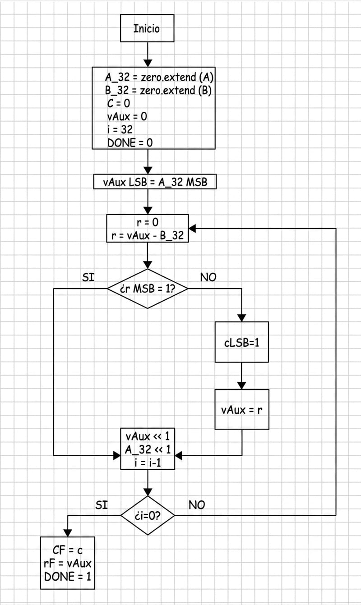
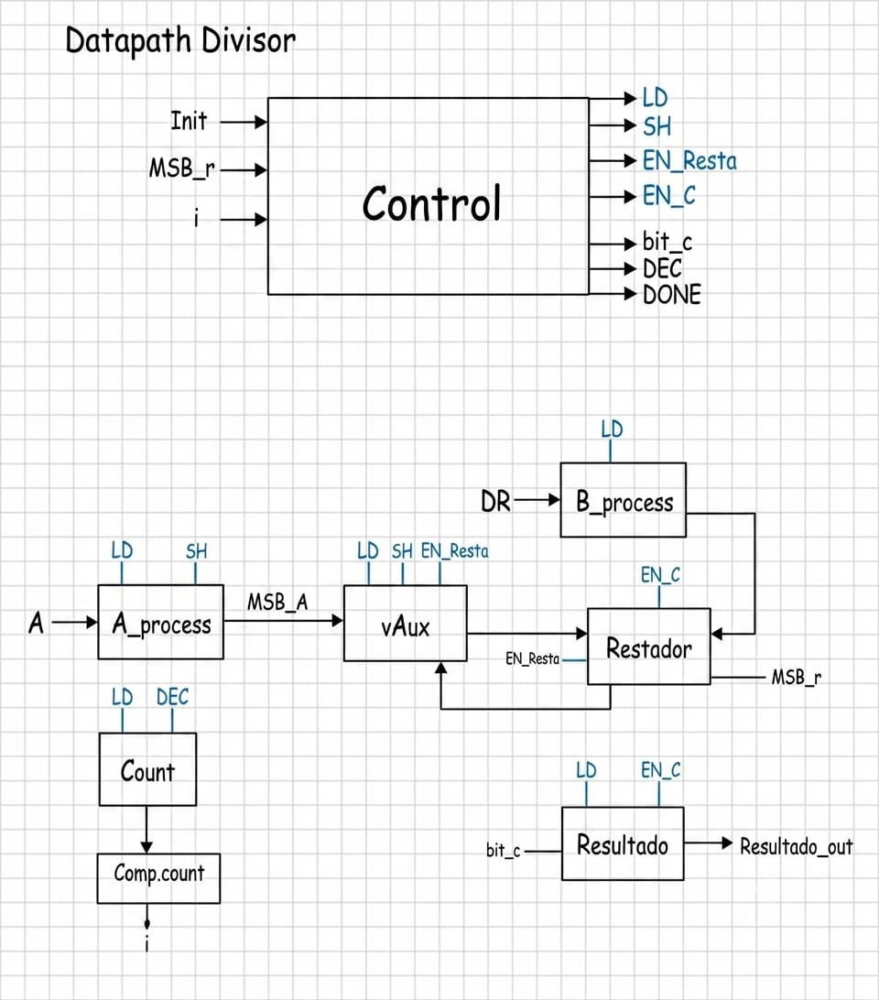
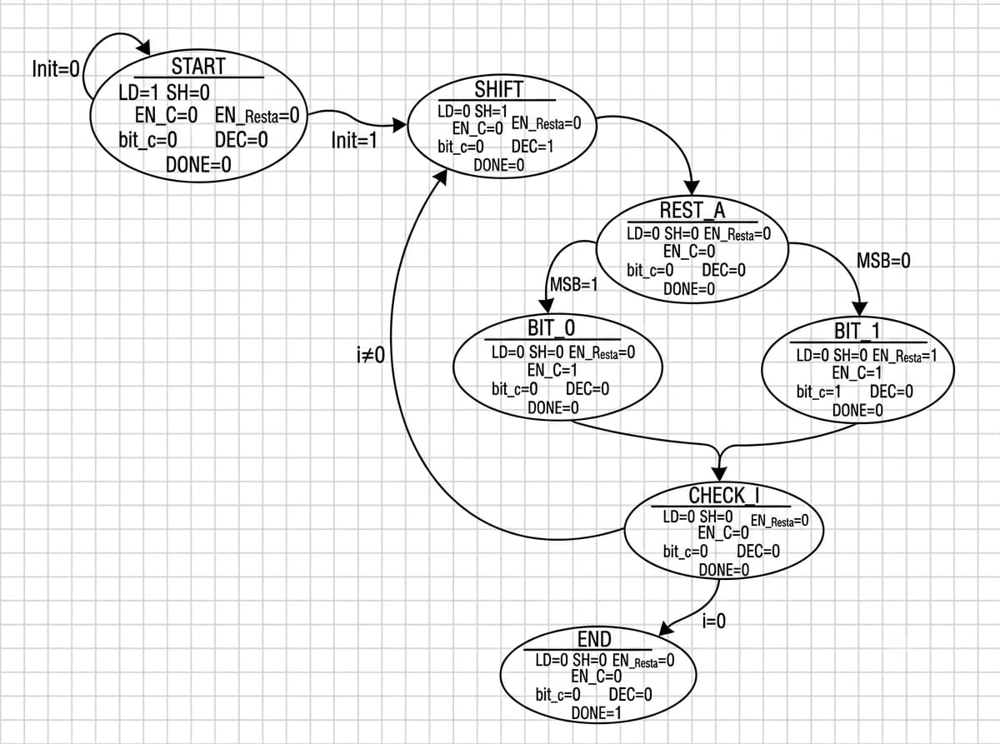

# ➗ Divisor

[⬅ Volver a Calculadora](../../../README_Calculadora.md) · [🏠 Volver al README principal](../../../../README.md)

## 📘 Descripción general

Este módulo implementa una **división binaria secuencial sin signo** mediante corrimientos, comparaciones y restas sucesivas.

Recibe dos operandos de 32 bits:

- `Dividendo`: número que se desea dividir.
- `DR`: divisor.

Al finalizar, entrega dos resultados de 32 bits:

- `Resultado`: cociente de la división.
- `Residuo`: valor restante después de realizar la división.

La operación se desarrolla durante 32 iteraciones coordinadas por una máquina de estados.

---

## 📂 Ubicación de los archivos

```text
Calculadora/
├── Diagramas/
│   └── Diagramas_Divisor/
│       ├── Diagramas_Divisor_Flujo.png
│       ├── Diagramas_Divisor_Datapath.png
│       └── Diagramas_Divisor_Estados.png
│
├── Fimware/
│   └── asm/
│       └── Divisor.S
│
└── rtl/
    └── Cores/
        └── Divisor/
            ├── A_process_Divisor.v
            ├── B_process_Divisor.v
            ├── Comp_count_Divisor.v
            ├── Control_Divisor.v
            ├── Count_Divisior.v
            ├── Periferico_Divisor.v
            ├── Periferico_Divisor.vcd
            ├── Restador.v
            ├── Resultado.v
            ├── Testbench_Divisor.v
            ├── Testbench_Periferico_Divisor.v
            ├── TOP_Divisor.v
            ├── vAux.v
            └── README.md
```

> El archivo se llama `Count_Divisior.v` dentro del repositorio, aunque el módulo declarado en su interior se llama `Count_Divisor`.

---

## ⚙️ Funcionamiento

El divisor utiliza un procedimiento iterativo semejante a la división larga binaria.

1. Se carga el dividendo en `A_process`.
2. Se carga el divisor en `B_process`.
3. El registro auxiliar `vAux` se inicializa en cero.
4. El registro `Resultado` se inicializa en cero.
5. El contador se carga con el valor 32.
6. Se desplaza el dividendo hacia la izquierda.
7. El bit más significativo del dividendo se introduce en el bit menos significativo de `vAux`.
8. El restador calcula:

```text
Resta_out = vAux_out - B_out
```

9. Se revisa el bit más significativo de la resta:
   - Si `MSB_r = 1`, la resta es negativa. Se descarta la resta y se agrega un `0` al cociente.
   - Si `MSB_r = 0`, la resta es válida. Se conserva el resultado de la resta en `vAux` y se agrega un `1` al cociente.
10. El contador disminuye en una unidad.
11. El procedimiento se repite hasta completar las 32 iteraciones.
12. Al terminar, `Resultado` contiene el cociente y `vAux` contiene el residuo.

---

## 🧭 Diagramas

### Diagrama de flujo

<p align="center">
  
</p>

### Datapath

<p align="center">
  
</p>

### Diagrama de estados

<p align="center">
  
</p>

---

## 🔌 Interfaz del módulo TOP

El módulo principal es `TOP_Divisor.v`.

| Señal | Dirección | Bits | Descripción |
|---|---:|---:|---|
| `clk` | Entrada | 1 | Señal de reloj del sistema. |
| `rst` | Entrada | 1 | Reinicia los registros y la máquina de control. |
| `init` | Entrada | 1 | Solicita el inicio de una división. |
| `Dividendo` | Entrada | 32 | Número que se desea dividir. |
| `DR` | Entrada | 32 | Divisor. |
| `Residuo` | Salida | 32 | Residuo final de la operación. |
| `Resultado` | Salida | 32 | Cociente final. |
| `DONE` | Salida | 1 | Indica que la división terminó. |

---

## 🧩 Camino de datos

El camino de datos está formado por siete bloques principales.

| Módulo | Función |
|---|---|
| `A_process_Divisor.v` | Almacena el dividendo y lo desplaza hacia la izquierda. |
| `B_process_Divisor.v` | Almacena el divisor durante toda la operación. |
| `vAux.v` | Construye el residuo parcial, recibe bits del dividendo y conserva las restas válidas. |
| `Restador.v` | Calcula `vAux_out - B_out` y entrega la bandera `MSB_r`. |
| `Resultado.v` | Construye el cociente bit a bit. |
| `Count_Divisior.v` | Contador descendente de las 32 iteraciones. |
| `Comp_count_Divisor.v` | Genera la bandera `i` mientras el contador sea diferente de cero. |

### Registro del dividendo

`A_process_Divisor` carga el dividendo cuando `LD = 1`.

```text
A_out = Dividendo
```

Cuando `SH = 1`, realiza:

```text
A_out = A_out << 1
```

Su bit más significativo se entrega mediante:

```text
MSB_A = A_out[31]
```

Ese bit se utiliza para formar el siguiente residuo parcial.

### Registro del divisor

`B_process_Divisor` carga `DR` cuando `LD = 1` y mantiene ese valor durante toda la operación.

```text
B_out = DR
```

Este registro no necesita corrimientos porque el divisor permanece constante.

### Registro auxiliar `vAux`

El módulo `vAux` cumple tres funciones:

1. Se limpia cuando `LD = 1`.
2. Incorpora el bit más significativo del dividendo cuando `SH = 1`.
3. Conserva el resultado de una resta válida cuando `EN_Resta = 1`.

Durante el corrimiento ejecuta:

```text
vAux_out = {vAux_out[30:0], MSB_A}
```

Cuando la resta es válida ejecuta:

```text
vAux_out = Resta_in
```

Al finalizar, `vAux_out` se conecta directamente a la salida `Residuo`.

### Restador

`Restador_Divisor` es un bloque combinacional:

```text
Resta_out = vAux_out - B_out
```

La salida:

```text
MSB_r = Resta_out[31]
```

permite determinar si la resta produjo un resultado negativo.

- `MSB_r = 1`: la resta no se conserva.
- `MSB_r = 0`: la resta se almacena en `vAux`.

### Registro del resultado

El módulo `Resultado` construye el cociente bit a bit.

Cuando `EN_C = 1`, desplaza el cociente e introduce `bit_c`:

```text
Resultado_out = {Resultado_out[30:0], bit_c}
```

- `bit_c = 0`: el divisor no cabe en el residuo parcial.
- `bit_c = 1`: el divisor sí cabe y la resta fue aceptada.

---

## 🎛️ Señales de control y estado

| Señal | Tipo | Función |
|---|---|---|
| `LD` | Control | Carga los operandos, limpia `vAux` y `Resultado`, e inicializa el contador. |
| `SH` | Control | Desplaza el dividendo e incorpora su MSB en `vAux`. |
| `EN_Resta` | Control | Guarda `Resta_out` en `vAux`. |
| `EN_C` | Control | Habilita el corrimiento del registro del cociente. |
| `bit_c` | Control | Bit que se agrega al cociente: `0` o `1`. |
| `DEC` | Control | Disminuye el contador en una unidad. |
| `MSB_A` | Estado | Bit más significativo actual del registro del dividendo. |
| `MSB_r` | Estado | Indica si la resta es negativa. |
| `i` | Estado | Vale `1` mientras el contador sea diferente de cero. |
| `DONE` | Salida | Indica que el cociente y el residuo están disponibles. |

---

## 🔄 Unidad de control

`Control_Divisor.v` implementa siete estados.

| Estado | Operación |
|---|---|
| `START` | Activa `LD`, prepara todos los registros y espera `init = 1`. |
| `SHIFT` | Activa `SH` y `DEC` para desplazar el dividendo, actualizar `vAux` y disminuir el contador. |
| `RESTA` | Revisa `MSB_r` para decidir si la resta es válida. |
| `BIT_0` | Activa `EN_C` e introduce un `0` en el cociente. |
| `BIT_1` | Activa `EN_C`, introduce un `1` en el cociente y activa `EN_Resta`. |
| `CHECK_I` | Revisa si aún quedan iteraciones. |
| `END1` | Activa `DONE` y luego regresa al estado inicial. |

La secuencia general es:

```text
START
  │ init = 1
  ▼
SHIFT
  ▼
RESTA
  ├── MSB_r = 1 ─→ BIT_0 ─┐
  └── MSB_r = 0 ─→ BIT_1 ─┤
                           ▼
                        CHECK_I
                    ┌──────┴──────┐
                 i = 1          i = 0
                    │              │
                    ▼              ▼
                  SHIFT           END1
```

---

## 🏗️ Módulo TOP

`TOP_Divisor.v` interconecta la unidad de control y todos los bloques del camino de datos.

Las conexiones principales son:

```text
Control ── LD ───────→ A_process, B_process, vAux, Resultado y Count
Control ── SH ───────→ A_process y vAux
Control ── EN_Resta ─→ vAux
Control ── EN_C ─────→ Resultado
Control ── bit_c ────→ Resultado
Control ── DEC ──────→ Count

A_process ── MSB_A ───────────────→ vAux
vAux ────────────────┐
                     ├──→ Restador ── MSB_r ─→ Control
B_process ───────────┘

Count ─→ Comp_count ── i ─────────→ Control
Resultado ─────────────────────────→ Resultado
vAux ──────────────────────────────→ Residuo
```

---

## 📄 Archivos del módulo

| Archivo | Descripción |
|---|---|
| `A_process_Divisor.v` | Registro del dividendo y corrimiento hacia la izquierda. |
| `B_process_Divisor.v` | Registro que conserva el divisor. |
| `vAux.v` | Registro del residuo parcial. |
| `Restador.v` | Realiza la resta entre el residuo parcial y el divisor. |
| `Resultado.v` | Construye el cociente bit a bit. |
| `Count_Divisior.v` | Contador descendente de 32 iteraciones. |
| `Comp_count_Divisor.v` | Indica si aún quedan iteraciones. |
| `Control_Divisor.v` | Máquina de estados que genera las señales de control. |
| `TOP_Divisor.v` | Integra el camino de datos y la unidad de control. |
| `Periferico_Divisor.v` | Conecta el divisor al procesador RISC-V. |
| `Testbench_Divisor.v` | Verifica directamente el funcionamiento del módulo `TOP`. |
| `Testbench_Periferico_Divisor.v` | Verifica las lecturas y escrituras del periférico. |
| `Divisor.S` | Rutina en ensamblador utilizada para acceder al periférico desde el procesador. |

---

# 🔗 Periférico del divisor

`Periferico_Divisor.v` permite que el procesador escriba el dividendo y el divisor, inicie la operación y lea el cociente, el residuo y la señal de finalización.

## Interfaz del periférico

| Señal | Dirección | Bits | Descripción |
|---|---:|---:|---|
| `clk` | Entrada | 1 | Reloj del sistema. |
| `reset` | Entrada | 1 | Reinicio del periférico. |
| `d_in` | Entrada | 32 | Datos enviados por el procesador. |
| `cs` | Entrada | 1 | Selección del periférico. |
| `addr` | Entrada | 5 | Dirección interna del registro. |
| `rd` | Entrada | 1 | Habilita una operación de lectura. |
| `wr` | Entrada | 1 | Habilita una operación de escritura. |
| `d_out` | Salida | 32 | Datos entregados al procesador. |

## Mapa de registros

La dirección base utilizada por el software es:

```text
DIV_BASE = 0x00430000
```

| Dirección | Registro | Acceso | Descripción |
|---:|---|---|---|
| `DIV_BASE + 0x04` | `DIVIDENDO` | Escritura | Dividendo de 32 bits. |
| `DIV_BASE + 0x08` | `DR` | Escritura | Divisor de 32 bits. |
| `DIV_BASE + 0x0C` | `INIT` | Escritura | Inicio de la operación. |
| `DIV_BASE + 0x10` | `RESULTADO` | Lectura | Cociente de 32 bits. |
| `DIV_BASE + 0x14` | `RESIDUO` | Lectura | Residuo de 32 bits. |
| `DIV_BASE + 0x18` | `DONE` | Lectura | Estado de finalización. |

Cuando se escribe `1` en `INIT`, el periférico limpia:

```text
DONE_reg
Resultado_reg
Residuo_reg
```

Cuando el módulo `TOP` activa `DONE_wire`, el periférico guarda:

```text
Resultado_reg = Resultado_wire
Residuo_reg   = Residuo_wire
DONE_reg      = 1
```

De esta manera, el procesador puede leer el resultado incluso después de que el pulso interno `DONE_wire` haya terminado.

---

## 💻 Rutina en ensamblador

El archivo [`Divisor.S`](../../../Fimware/asm/Divisor.S) define la función global:

```text
div_hw
```

La función recibe:

```text
a0 = Dividendo sin signo de 32 bits
a1 = Divisor sin signo de 32 bits
```

Y devuelve:

```text
a0 = Cociente sin signo de 32 bits
```

La rutina utiliza la dirección base:

```text
DIV_BASE = 0x00430000
```

y define los siguientes desplazamientos:

```text
DIV_DIVIDENDO = 0x04
DIV_DR        = 0x08
DIV_INIT      = 0x0C
DIV_RESULTADO = 0x10
DIV_RESIDUO   = 0x14
DIV_DONE      = 0x18
```

La secuencia ejecutada por `div_hw` es:

1. Cargar `DIV_BASE` en el registro `gp`.
2. Escribir el dividendo almacenado en `a0`.
3. Escribir el divisor almacenado en `a1`.
4. Escribir `1` en `DIV_INIT`.
5. Escribir `0` en `DIV_INIT` para completar el pulso de inicio.
6. Leer repetidamente `DIV_DONE`.
7. Permanecer en espera mientras `DONE = 0`.
8. Leer `DIV_RESULTADO`.
9. Retornar el cociente en `a0`.

La espera activa se implementa con:

```asm
.wait_div:
    lw   t1, DIV_DONE(gp)
    andi t1, t1, 1
    beqz t1, .wait_div
```

Finalmente, el cociente se obtiene con:

```asm
lw   a0, DIV_RESULTADO(gp)
ret
```

> Aunque `DIV_RESIDUO` está definido en el mapa de memoria y puede leerse desde el periférico, la versión actual de `div_hw` no devuelve el residuo. La función únicamente retorna el cociente en `a0`.

---

# 🧪 Simulación

Las simulaciones deben ejecutarse desde:

```text
Calculadora/rtl/Cores/Divisor/
```

## Prueba del módulo TOP

`Testbench_Divisor.v` realiza:

```text
100 / 12
```

Resultados esperados:

```text
Cociente = 8
Residuo  = 4
```

Compilación:

```bash
iverilog -s Testbench_Divisor -o sim_divisor *.v
```

Ejecución:

```bash
vvp sim_divisor
```

Visualización:

```bash
gtkwave divisor.vcd
```

## Prueba del periférico

`Testbench_Periferico_Divisor.v` realiza dos operaciones sin reiniciar el sistema entre ellas.

### Operación 1

```text
100 / 12
```

Resultados esperados:

```text
DONE     = 1
Cociente = 8
Residuo  = 4
```

### Operación 2

```text
25 / 5
```

Resultados esperados:

```text
DONE     = 1
Cociente = 5
Residuo  = 0
```

Antes de la segunda operación, el testbench verifica que al escribir nuevamente `INIT = 1` se limpien los registros latcheados del periférico.

Compilación:

```bash
iverilog -s Testbench_Periferico_Divisor -o sim_periferico_divisor *.v
```

Ejecución:

```bash
vvp sim_periferico_divisor
```

Visualización:

```bash
gtkwave Periferico_Divisor.vcd
```

---

## ✅ Resultado

El módulo permite realizar divisiones binarias sin signo de 32 bits mediante una arquitectura secuencial formada por un camino de datos y una unidad de control. Entrega tanto el cociente como el residuo y puede utilizarse de forma independiente o como periférico del procesador RISC-V.
