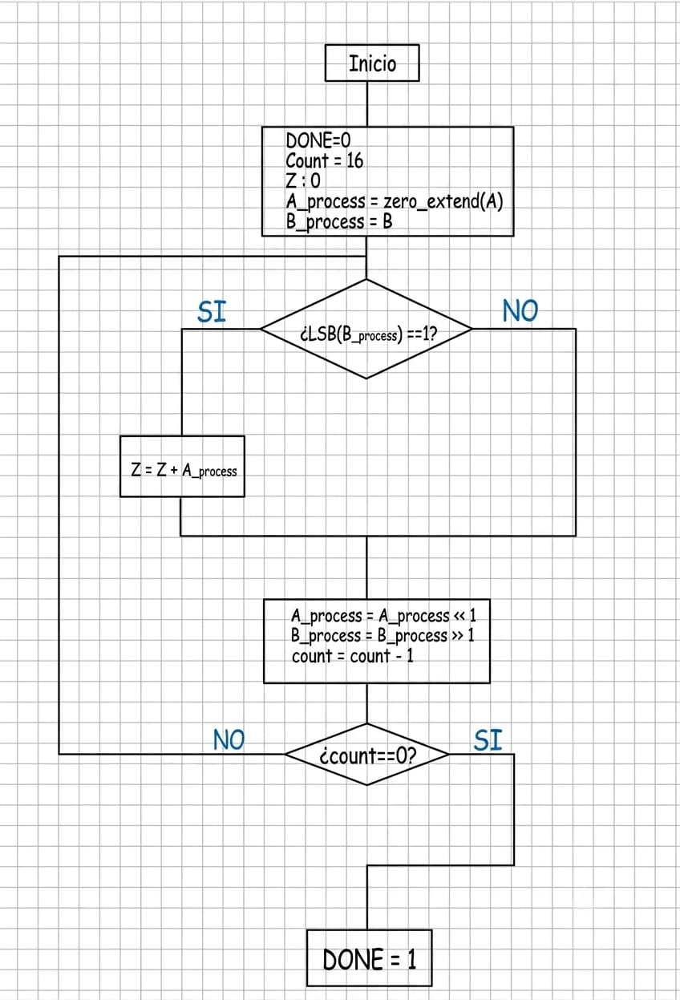
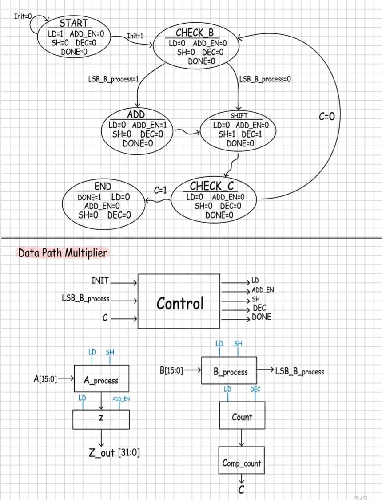

# ✖️ Multiplicador

[⬅ Volver a Calculadora](../../../README_Calculadora.md) · [🏠 Volver al README principal](../../../../README.md)

## 📘 Descripción general

Este módulo implementa una **multiplicación binaria secuencial sin signo** mediante corrimientos y sumas parciales.

Recibe dos operandos de 16 bits:

- `A`: multiplicando.
- `B`: multiplicador.

El resultado se construye en el registro acumulador `Z` y tiene una longitud de 32 bits. La operación se desarrolla durante 16 iteraciones controladas por una máquina de estados.

---

## 📂 Ubicación de los archivos

```text
Calculadora/
├── Diagramas/
│   └── Diagramas_Multiplicador/
│       ├── Diagramas_Multiplicador_Flujo.png
│       └── Diagramas_Multiplicador_Datapath.png
│
├── Fimware/
│   └── asm/
│       └── Multiplicador.S
│
└── rtl/
    └── Cores/
        └── Multiplicador/
            ├── A_process_Multiplicador.v
            ├── B_process_Multiplicador.v
            ├── Comp_count_Multiplicador.v
            ├── Control_Multiplicador.v
            ├── Count_Multiplicador.v
            ├── Periferico_Multiplicador.v
            ├── Testbench_Multiplicador.v
            ├── Testbench_Periferico_Multiplicador.v
            ├── TOP_Multiplicador.v
            ├── Z.v
            └── README.md
```

---

## ⚙️ Funcionamiento

El multiplicador utiliza el método de productos parciales. En cada iteración se analiza el bit menos significativo del registro que contiene a `B`.

1. Se cargan los operandos en los registros internos.
2. El registro acumulador `Z` se inicializa en cero.
3. El contador se carga con el valor 16.
4. Se revisa el bit menos significativo de `B`.
5. Cuando ese bit vale `1`, el valor actual de `A` se suma a `Z`.
6. El registro de `A` se desplaza un bit a la izquierda.
7. El registro de `B` se desplaza un bit a la derecha.
8. El contador disminuye en una unidad.
9. El proceso se repite hasta que el contador llega a cero.
10. La señal `DONE` indica que el resultado está disponible.

El corrimiento de `A` representa la multiplicación por potencias de dos, mientras que el corrimiento de `B` permite revisar cada uno de sus bits, desde el menos significativo hasta el más significativo.

---

## 🧭 Diagramas

### Diagrama de flujo

<p align="center">
  
</p>

### Datapath y unidad de control

<p align="center">
  
</p>

---

## 🔌 Interfaz del módulo TOP

El módulo principal es `TOP_Multiplicador.v`.

| Señal | Dirección | Bits | Descripción |
|---|---:|---:|---|
| `reset` | Entrada | 1 | Reinicia la máquina de control. |
| `clk` | Entrada | 1 | Señal de reloj del sistema. |
| `init` | Entrada | 1 | Solicita el inicio de la multiplicación. |
| `A` | Entrada | 16 | Multiplicando sin signo. |
| `B` | Entrada | 16 | Multiplicador sin signo. |
| `Resultado` | Salida | 32 | Producto final de `A × B`. |
| `DONE` | Salida | 1 | Indica que la operación terminó. |

---

## 🧩 Camino de datos

El camino de datos está formado por los siguientes bloques:

| Módulo | Función |
|---|---|
| `A_process_Multiplicador.v` | Carga `A` en un registro de 32 bits y lo desplaza hacia la izquierda en cada iteración. |
| `B_process_Multiplicador.v` | Carga `B`, lo desplaza hacia la derecha y entrega su bit menos significativo mediante `LSB_B_process`. |
| `Z.v` | Acumulador de 32 bits donde se construye el producto mediante sumas parciales. |
| `Count_Multiplicador.v` | Contador descendente que se inicializa en 16 y disminuye después de cada corrimiento. |
| `Comp_count_Multiplicador.v` | Activa la bandera `C` cuando el contador llega a cero. |

### Registro del multiplicando

`A_process_Multiplicador` carga inicialmente:

```text
A_process_out = {16'b0, A}
```

Después, cuando `SH = 1`, realiza:

```text
A_process_out = A_process_out << 1
```

De esta manera, el multiplicando adquiere el peso correspondiente a cada posición del multiplicador.

### Registro del multiplicador

`B_process_Multiplicador` almacena el operando `B`. Su bit menos significativo se conecta directamente a:

```text
LSB_B_process = B_process_out[0]
```

Cuando `SH = 1`, el registro se desplaza hacia la derecha para presentar el siguiente bit.

### Acumulador

El módulo `Z` inicia en cero cuando `LD = 1`. Cuando la unidad de control activa `ADD_EN`, ejecuta:

```text
Z_out = Z_out + A_process_out
```

Al finalizar, `Z_out` se conecta directamente a la salida `Resultado`.

---

## 🎛️ Señales de control y estado

| Señal | Tipo | Función |
|---|---|---|
| `LD` | Control | Carga los operandos, inicializa el contador y limpia el acumulador. |
| `ADD_EN` | Control | Habilita la suma del multiplicando al producto parcial. |
| `SH` | Control | Desplaza `A` hacia la izquierda y `B` hacia la derecha. |
| `DEC` | Control | Disminuye el contador en una unidad. |
| `LSB_B_process` | Estado | Indica el valor del bit menos significativo de `B`. |
| `C` | Estado | Se activa cuando el contador llega a cero. |
| `DONE` | Salida | Indica que el producto final está disponible. |

---

## 🔄 Unidad de control

`Control_Multiplicador.v` coordina el camino de datos mediante los siguientes estados:

| Estado | Operación |
|---|---|
| `S_START` | Mantiene `LD = 1`, carga los operandos, limpia `Z` e inicializa el contador. Espera `init = 1`. |
| `S_CHECK` | Revisa la bandera `C` y el bit `LSB_B_process`. |
| `S_ADD` | Activa `ADD_EN` para sumar el valor de `A_process_out` al acumulador. |
| `S_SHIFT` | Activa `SH` y `DEC` para realizar los corrimientos y disminuir el contador. |
| `S_END` | Activa `DONE` y conserva disponible el resultado antes de regresar al estado inicial. |

La secuencia general es:

```text
S_START
    ↓ init = 1
S_CHECK
    ├── C = 1 ───────────────→ S_END
    ├── C = 0 y LSB = 1 ─────→ S_ADD ─→ S_SHIFT
    └── C = 0 y LSB = 0 ──────────────→ S_SHIFT
                                             ↓
                                          S_CHECK
```

---

## 🏗️ Módulo TOP

`TOP_Multiplicador.v` interconecta todos los elementos del camino de datos y la unidad de control.

Las conexiones principales son:

```text
Control ── LD ─────→ A_process, B_process, Z y Count
Control ── SH ─────→ A_process y B_process
Control ── ADD_EN ─→ Z
Control ── DEC ────→ Count

B_process ── LSB_B_process ─→ Control
Count ─→ Comp_count ── C ───→ Control
Z ───────────────────────────→ Resultado
```

---

## 📄 Archivos del módulo

| Archivo | Descripción |
|---|---|
| `A_process_Multiplicador.v` | Registro de 32 bits que almacena y desplaza el multiplicando. |
| `B_process_Multiplicador.v` | Registro de 16 bits que almacena y desplaza el multiplicador. |
| `Z.v` | Acumulador donde se construye el producto final. |
| `Count_Multiplicador.v` | Contador de las 16 iteraciones del algoritmo. |
| `Comp_count_Multiplicador.v` | Comparador que detecta el final del conteo. |
| `Control_Multiplicador.v` | Máquina de estados que genera las señales de control. |
| `TOP_Multiplicador.v` | Integra el camino de datos y la unidad de control. |
| `Periferico_Multiplicador.v` | Adapta el multiplicador para conectarlo al procesador RISC-V. |
| `Testbench_Multiplicador.v` | Verifica directamente el funcionamiento del módulo `TOP`. |
| `Testbench_Periferico_Multiplicador.v` | Verifica las operaciones de lectura y escritura del periférico. |
| `Multiplicador.S` | Rutina en ensamblador que utiliza el periférico desde el procesador. |

---

# 🔗 Periférico del multiplicador

`Periferico_Multiplicador.v` permite que el procesador escriba los operandos, inicie la operación y lea el resultado mediante registros mapeados en memoria.

## Interfaz del periférico

| Señal | Dirección | Bits | Descripción |
|---|---:|---:|---|
| `clk` | Entrada | 1 | Reloj del sistema. |
| `reset` | Entrada | 1 | Reinicio del periférico. |
| `d_in` | Entrada | 16 | Datos enviados por el procesador. |
| `cs` | Entrada | 1 | Selección del periférico. |
| `addr` | Entrada | 5 | Dirección interna del registro. |
| `rd` | Entrada | 1 | Habilita una operación de lectura. |
| `wr` | Entrada | 1 | Habilita una operación de escritura. |
| `d_out` | Salida | 32 | Datos entregados al procesador. |

## Mapa de registros

La dirección base usada por el software es:

```text
MUL_BASE = 0x00440000
```

| Dirección | Registro | Acceso | Descripción |
|---:|---|---|---|
| `MUL_BASE + 0x04` | `A` | Escritura | Multiplicando de 16 bits. |
| `MUL_BASE + 0x08` | `B` | Escritura | Multiplicador de 16 bits. |
| `MUL_BASE + 0x0C` | `INIT` | Escritura | Inicio de la operación. |
| `MUL_BASE + 0x10` | `RESULTADO` | Lectura | Producto almacenado de 32 bits. |
| `MUL_BASE + 0x14` | `DONE` | Lectura | Estado de finalización. |

Cuando se inicia una nueva operación, `DONE_status` y `Resultado_status` se limpian. Cuando el módulo `TOP` activa `DONE_top`, el periférico almacena el resultado y mantiene `DONE_status = 1` para que el procesador pueda consultarlo posteriormente.

---

## 💻 Rutina en ensamblador

El archivo [`Multiplicador.S`](../../../Fimware/asm/Multiplicador.S) define la función global:

```text
mult_hw
```

La función recibe:

```text
a0 = A
a1 = B
```

Y devuelve:

```text
a0 = Resultado
```

La secuencia realizada por el software es:

1. Cargar la dirección base del periférico.
2. Escribir `A`.
3. Escribir `B`.
4. Escribir `1` en `INIT`.
5. Escribir `0` en `INIT`.
6. Consultar repetidamente el registro `DONE`.
7. Leer el registro `RESULTADO`.
8. Retornar el producto en `a0`.

---

# 🧪 Simulación

Las simulaciones deben ejecutarse desde:

```text
Calculadora/rtl/Cores/Multiplicador/
```

## Prueba del módulo TOP

`Testbench_Multiplicador.v` realiza la operación:

```text
2 × 8 = 16
```

Compilación:

```bash
iverilog -s Testbench_Multiplicador -o sim_multiplicador *.v
```

Ejecución:

```bash
vvp sim_multiplicador
```

Visualización:

```bash
gtkwave Multiplicador.vcd
```

El resultado esperado en la terminal es:

```text
Resultado = 16
```

## Prueba del periférico

`Testbench_Periferico_Multiplicador.v` escribe los operandos mediante los registros del periférico y realiza la operación:

```text
13 × 16 = 208
```

Compilación:

```bash
iverilog -s Testbench_Periferico_Multiplicador -o sim_periferico_multiplicador *.v
```

Ejecución:

```bash
vvp sim_periferico_multiplicador
```

Visualización:

```bash
gtkwave Periferico_Multiplicador.vcd
```

Los valores esperados son:

```text
DONE leído = 1
Resultado leído = 208
```

---

## ✅ Resultado

El módulo permite realizar multiplicaciones sin signo de 16 bits mediante una arquitectura secuencial compuesta por camino de datos y unidad de control. Además, puede probarse de forma independiente o utilizarse como periférico del procesador RISC-V dentro de la calculadora.
