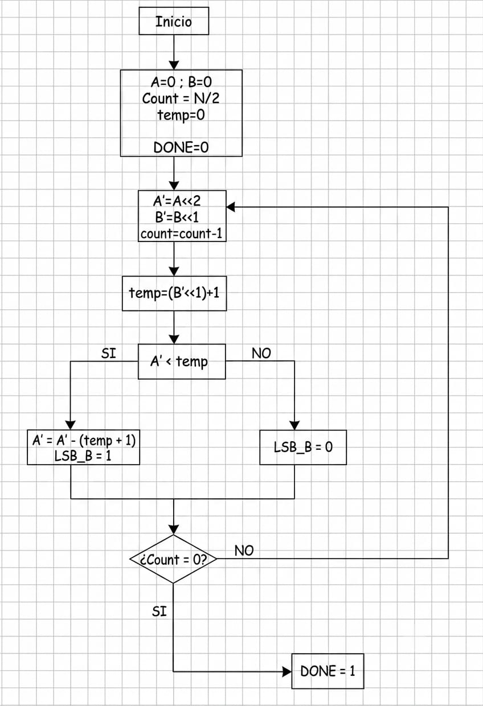
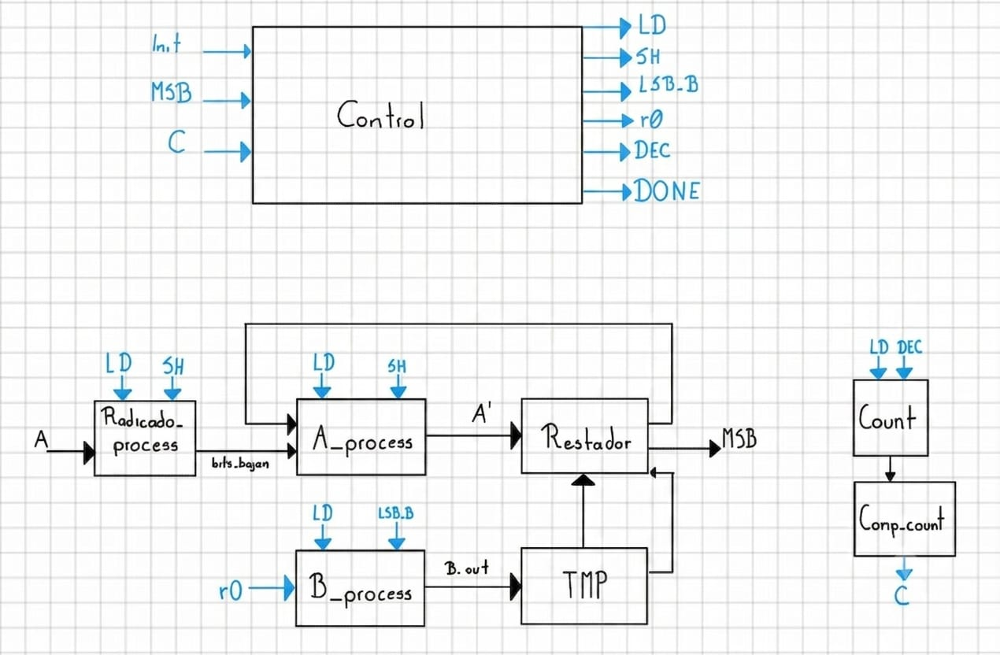
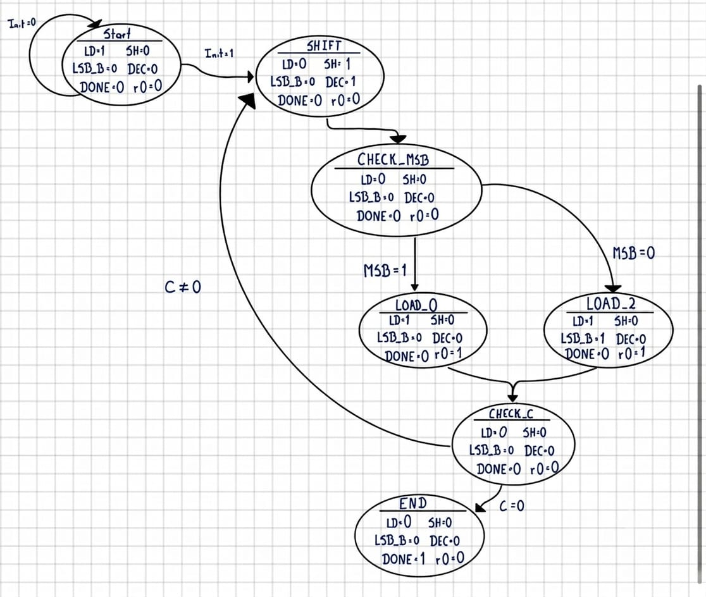

# √ Raíz cuadrada

[⬅ Volver a Calculadora](../../../README_Calculadora.md) · [🏠 Volver al README principal](../../../../README.md)

## 📘 Descripción general

Este módulo calcula la **raíz cuadrada entera sin signo de un número binario de 32 bits** mediante un algoritmo secuencial semejante al procedimiento de raíz larga.

El radicando se procesa en parejas de bits, desde los bits más significativos hasta los menos significativos. En cada iteración se forma un residuo parcial, se construye un valor de prueba a partir de la raíz parcial y se realiza una resta para decidir si el siguiente bit de la raíz debe ser `0` o `1`.

El módulo entrega:

- Una raíz de 16 bits.
- Un residuo de 32 bits.
- Una señal `done` que indica el final de la operación.

Como el radicando tiene 32 bits y se procesan dos bits por iteración, el algoritmo realiza 16 iteraciones.

---

## 📂 Ubicación de los archivos

```text
Calculadora/
├── Diagramas/
│   └── Diagramas_Raiz/
│       ├── Diagramas_Raiz_Flujo.png
│       ├── Diagramas_Raiz_Datapath.png
│       └── Diagramas_Raiz_Estados.png
│
├── Fimware/
│   └── asm/
│       └── Raiz.S
│
└── rtl/
    └── Cores/
        └── Raiz/
            ├── A_process_Raiz.v
            ├── B_process_Raiz.v
            ├── Comp_count_Raiz.v
            ├── Control_Raiz.v
            ├── Count_Raiz.v
            ├── Periferico_Raiz.v
            ├── Radicando_process.v
            ├── Restador.v
            ├── Testbench_Periferico_Raiz.v
            ├── Testbench_Raiz.v
            ├── TMP.v
            ├── TOP_Raiz.v
            └── README.md
```

---

## ⚙️ Funcionamiento

El procedimiento general es el siguiente:

1. Se carga el número de entrada en `Radicando_process`.
2. El registro de residuo parcial `A_process` se inicializa en cero.
3. El registro de raíz parcial `B_process` se inicializa en cero.
4. El contador se carga con el valor 16.
5. Se toman los dos bits más significativos disponibles del radicando.
6. Esos dos bits se incorporan al residuo parcial.
7. La raíz parcial se desplaza una posición a la izquierda.
8. El módulo `TMP` construye el valor de prueba:

```text
TMP = (B_process << 2) + 1
```

9. El restador calcula:

```text
Resta = A_process - TMP
```

10. Se revisa el bit más significativo de la resta:
    - Si `MSB = 1`, el resultado es negativo. La resta se descarta y se agrega un `0` a la raíz.
    - Si `MSB = 0`, la resta es válida. El resultado se almacena como nuevo residuo y se agrega un `1` a la raíz.
11. El contador disminuye una unidad.
12. El proceso continúa hasta completar las 16 iteraciones.
13. Al finalizar, `B` contiene la raíz y `Residuo` contiene el valor restante.

La relación final es:

```text
A = B² + Residuo
```

donde `B` es la raíz cuadrada entera.

---

## 🧭 Diagramas

### Diagrama de flujo

<p align="center">
  
</p>

### Datapath

<p align="center">
  
</p>

### Diagrama de estados

<p align="center">
  
</p>

---

## 🔌 Interfaz del módulo TOP

El módulo principal es `TOP_Raiz.v`.

| Señal | Dirección | Bits | Descripción |
|---|---:|---:|---|
| `clk` | Entrada | 1 | Señal de reloj del sistema. |
| `rst` | Entrada | 1 | Reinicia los registros y la unidad de control. |
| `init` | Entrada | 1 | Solicita el inicio del cálculo. |
| `A` | Entrada | 32 | Radicando sin signo. |
| `B` | Salida | 16 | Raíz cuadrada entera. |
| `Residuo` | Salida | 32 | Residuo final del cálculo. |
| `done` | Salida | 1 | Indica que la operación terminó. |

---

## 🧩 Camino de datos

El camino de datos está formado por los siguientes bloques:

| Módulo | Función |
|---|---|
| `Radicando_process.v` | Almacena el radicando y entrega sus bits en parejas. |
| `A_process_Raiz.v` | Almacena el residuo parcial y conserva las restas válidas. |
| `B_process_Raiz.v` | Construye la raíz bit a bit. |
| `TMP.v` | Genera el valor de prueba a partir de la raíz parcial. |
| `Restador.v` | Compara el residuo parcial con el valor de prueba mediante una resta. |
| `Count_Raiz.v` | Cuenta las 16 iteraciones del algoritmo. |
| `Comp_count_Raiz.v` | Indica cuándo el contador llegó a cero. |

### Procesamiento del radicando

`Radicando_process` carga el operando `A` cuando `ld_init = 1`.

```text
radicando_reg = A
```

Los dos bits que se procesan en cada iteración son:

```text
bits_bajan = radicando_reg[31:30]
```

Cuando `sh = 1`, el registro se desplaza dos posiciones hacia la izquierda:

```text
radicando_reg = radicando_reg << 2
```

De esta manera, la siguiente pareja de bits queda disponible para la siguiente iteración.

### Registro del residuo parcial

`A_process_Raiz` se inicializa en cero y forma el nuevo residuo parcial mediante:

```text
A_out = (A_out << 2) | bits_bajan
```

Cuando la resta es válida y `lda2 = 1`, almacena:

```text
A_out = Resta_out
```

La salida `A_out` se conecta directamente a `Residuo`.

### Registro de la raíz

`B_process_Raiz` construye la raíz de 16 bits.

Cuando `r0 = 1`, desplaza la raíz parcial e introduce el valor de `lsb_b`:

```text
B_out = {B_out[14:0], lsb_b}
```

- `lsb_b = 0`: se agrega un cero a la raíz.
- `lsb_b = 1`: se agrega un uno a la raíz.

La salida `B_out` se conecta directamente a la salida `B` del módulo `TOP`.

### Valor de prueba

El módulo `TMP` genera un valor combinacional a partir de la raíz parcial:

```text
TMP_out = (B_out << 2) + 1
```

Este valor se compara con el residuo parcial para determinar el siguiente bit de la raíz.

### Restador

`Restador_Raiz` calcula:

```text
Resta_out = A_process_out - TMP_out
```

También entrega:

```text
MSB = Resta_out[31]
```

- `MSB = 1`: la resta produjo un valor negativo.
- `MSB = 0`: la resta es válida y puede almacenarse.

### Contador y comparador

`Count_Raiz` se carga con 16 cuando `ld_init = 1` y disminuye cuando `dec = 1`.

```text
count_out = count_out - 1
```

`Comp_count_Raiz` genera:

```text
C = 1, cuando count_out = 0
```

---

## 🎛️ Señales de control y estado

| Señal | Tipo | Función |
|---|---|---|
| `ld_init` | Control | Inicializa los registros y carga el radicando y el contador. |
| `sh` | Control | Desplaza el radicando y actualiza el residuo parcial. |
| `dec` | Control | Disminuye el contador. |
| `r0` | Control | Habilita la actualización del registro de la raíz. |
| `lsb_b` | Control | Bit que se incorpora a la raíz parcial. |
| `lda2` | Control | Guarda una resta válida en el registro del residuo. |
| `bits_bajan` | Datos | Pareja de bits tomada del radicando. |
| `MSB` | Estado | Indica si la resta es negativa. |
| `C` | Estado | Indica que se completaron las 16 iteraciones. |
| `done` | Salida | Indica que la raíz y el residuo están disponibles. |

---

## 🔄 Unidad de control

`Control_Raiz.v` implementa siete estados:

| Estado | Operación |
|---|---|
| `START` | Espera `init = 1` e inicializa el camino de datos. |
| `SHIFT_DEC` | Desplaza el radicando y el residuo parcial; también disminuye el contador. |
| `CHECK_MSB` | Revisa el signo del resultado entregado por el restador. |
| `LOAD_2` | Guarda la resta válida y agrega un `1` a la raíz. |
| `LOAD_0` | Descarta la resta y agrega un `0` a la raíz. |
| `CHECK_C` | Revisa si se completaron las 16 iteraciones. |
| `END1` | Activa `done` y luego regresa al estado inicial. |

La secuencia general es:

```text
START
  │ init = 1
  ▼
SHIFT_DEC
  ▼
CHECK_MSB
  ├── MSB = 1 ─→ LOAD_0 ─┐
  └── MSB = 0 ─→ LOAD_2 ─┤
                          ▼
                       CHECK_C
                   ┌──────┴──────┐
                  C = 0          C = 1
                    │              │
                    ▼              ▼
                SHIFT_DEC         END1
```

En `LOAD_0`:

```text
r0    = 1
lsb_b = 0
lda2  = 0
```

En `LOAD_2`:

```text
r0    = 1
lsb_b = 1
lda2  = 1
```

---

## 🏗️ Módulo TOP

`TOP_Raiz.v` interconecta la unidad de control con todos los bloques del camino de datos.

Las conexiones principales son:

```text
Control ── ld_init ─→ Radicando_process, A_process, B_process y Count
Control ── sh ──────→ Radicando_process y A_process
Control ── dec ─────→ Count
Control ── r0 ──────→ B_process
Control ── lsb_b ───→ B_process
Control ── lda2 ────→ A_process

Radicando_process ── bits_bajan ─→ A_process
B_process ───────────────────────→ TMP
A_process ────────────────┐
                          ├──→ Restador ── MSB ─→ Control
TMP ──────────────────────┘

Count ─→ Comp_count ── C ───────────────→ Control
B_process ───────────────────────────────→ B
A_process ───────────────────────────────→ Residuo
```

---

## 📄 Archivos del módulo

| Archivo | Descripción |
|---|---|
| `Radicando_process.v` | Almacena el radicando, lo desplaza y entrega parejas de bits. |
| `A_process_Raiz.v` | Registro del residuo parcial. |
| `B_process_Raiz.v` | Registro que construye la raíz. |
| `TMP.v` | Genera el valor de prueba usado en cada resta. |
| `Restador.v` | Realiza la resta y entrega la bandera `MSB`. |
| `Count_Raiz.v` | Contador descendente de 16 iteraciones. |
| `Comp_count_Raiz.v` | Detecta el final del conteo. |
| `Control_Raiz.v` | Máquina de estados que genera las señales de control. |
| `TOP_Raiz.v` | Integra el camino de datos y la unidad de control. |
| `Periferico_Raiz.v` | Conecta el módulo de raíz cuadrada al procesador RISC-V. |
| `Testbench_Raiz.v` | Verifica directamente el módulo `TOP`. |
| `Testbench_Periferico_Raiz.v` | Verifica las lecturas y escrituras del periférico. |
| `Raiz.S` | Rutina en ensamblador que utiliza el periférico desde el procesador. |

---

# 🔗 Periférico de raíz cuadrada

`Periferico_Raiz.v` permite que el procesador escriba el radicando, inicie el cálculo y lea la raíz, el residuo y la señal de finalización.

## Interfaz del periférico

| Señal | Dirección | Bits | Descripción |
|---|---:|---:|---|
| `clk` | Entrada | 1 | Reloj del sistema. |
| `reset` | Entrada | 1 | Reinicio del periférico. |
| `d_in` | Entrada | 32 | Datos enviados por el procesador. |
| `cs` | Entrada | 1 | Selección del periférico. |
| `addr` | Entrada | 5 | Dirección interna del registro. |
| `rd` | Entrada | 1 | Habilita una operación de lectura. |
| `wr` | Entrada | 1 | Habilita una operación de escritura. |
| `d_out` | Salida | 32 | Datos entregados al procesador. |

## Mapa de registros

La dirección base utilizada por el software es:

```text
SQRT_BASE = 0x00420000
```

| Dirección | Registro | Acceso | Descripción |
|---:|---|---|---|
| `SQRT_BASE + 0x04` | `OP_A` | Escritura | Radicando sin signo de 32 bits. |
| `SQRT_BASE + 0x08` | `INIT` | Escritura | Inicio del cálculo. |
| `SQRT_BASE + 0x0C` | `RESULTADO` | Lectura | Raíz cuadrada de 16 bits, extendida a 32 bits. |
| `SQRT_BASE + 0x10` | `RESIDUO` | Lectura | Residuo de 32 bits. |
| `SQRT_BASE + 0x14` | `DONE` | Lectura | Estado de finalización. |

Cuando se escribe `1` en `INIT`, el periférico limpia:

```text
DONE_status
Resultado_status
Residuo_status
```

Cuando el módulo `TOP` activa `DONE_wire`, el periférico guarda:

```text
Resultado_status = Resultado_wire
Residuo_status   = Residuo_wire
DONE_status      = 1
```

Esto permite que los resultados permanezcan disponibles hasta que el procesador los lea o inicie una nueva operación.

---

## 💻 Rutina en ensamblador

El archivo [`Raiz.S`](../../../Fimware/asm/Raiz.S) define la función global:

```text
sqrt_hw
```

La función recibe:

```text
a0 = Radicando sin signo de 32 bits
```

Y devuelve:

```text
a0 = Raíz cuadrada
a1 = Residuo
```

La rutina usa:

```text
SQRT_BASE      = 0x00420000
SQRT_OP_A      = 0x04
SQRT_INIT      = 0x08
SQRT_RESULTADO = 0x0C
SQRT_RESIDUO   = 0x10
SQRT_DONE      = 0x14
```

La secuencia ejecutada por `sqrt_hw` es:

1. Cargar `SQRT_BASE` en `t0`.
2. Escribir el radicando almacenado en `a0`.
3. Escribir `1` en `SQRT_INIT`.
4. Escribir `0` en `SQRT_INIT` para completar el pulso de inicio.
5. Leer repetidamente `SQRT_DONE`.
6. Esperar mientras `DONE = 0`.
7. Leer la raíz y almacenarla en `a0`.
8. Leer el residuo y almacenarlo en `a1`.
9. Retornar al programa que llamó la función.

La espera activa se implementa mediante:

```asm
.wait_sqrt:
    lw   t2, SQRT_DONE(t0)
    andi t2, t2, 1
    beqz t2, .wait_sqrt
```

---

# 🧪 Simulación

Las simulaciones deben ejecutarse desde:

```text
Calculadora/rtl/Cores/Raiz/
```

## Prueba del módulo TOP

`Testbench_Raiz.v` realiza el cálculo:

```text
√26
```

Resultados esperados:

```text
Raíz    = 5
Residuo = 1
DONE    = 1
```

Esto cumple:

```text
26 = 5² + 1
```

Compilación:

```bash
iverilog -s Testbench_Raiz -o sim *.v
```

Ejecución:

```bash
vvp sim
```

Visualización:

```bash
gtkwave Raiz.vcd
```

## Prueba del periférico

`Testbench_Periferico_Raiz.v` escribe el radicando mediante el mapa de registros y calcula:

```text
√36
```

Resultados esperados:

```text
DONE      = 1
Resultado = 6
Residuo   = 0
```

Compilación:

```bash
iverilog -s Testbench_Periferico_Raiz -o sim *.v
```

Ejecución:

```bash
vvp sim
```

Visualización:

```bash
gtkwave Periferico_Raiz.vcd
```

---

## ✅ Resultado

El módulo calcula la raíz cuadrada entera sin signo de un radicando de 32 bits mediante un camino de datos secuencial y una unidad de control. El resultado se construye bit a bit durante 16 iteraciones y se entrega junto con el residuo. El diseño puede utilizarse de forma independiente o como periférico del procesador RISC-V.
