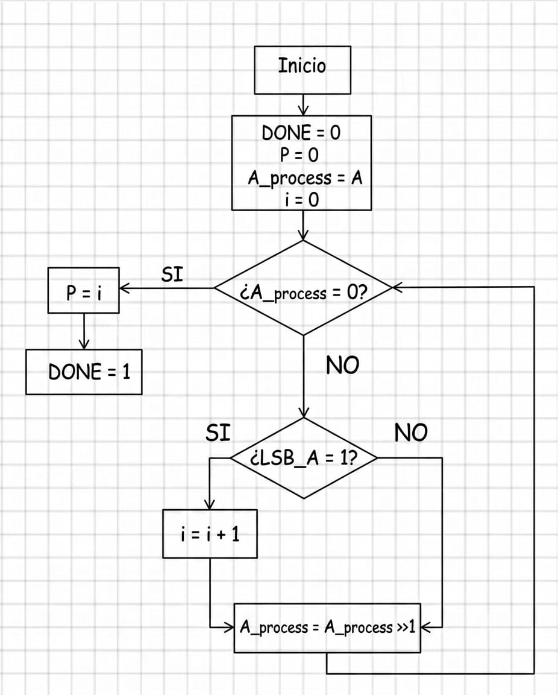
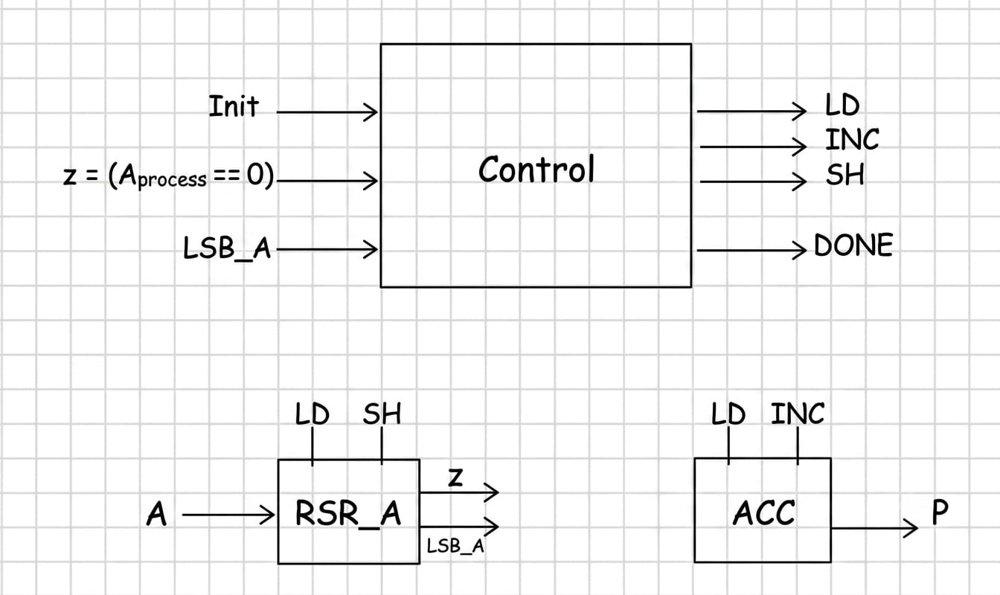
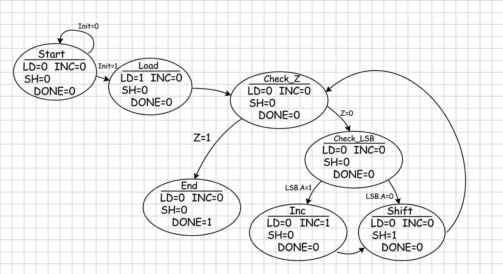

# 1️⃣ Contador de unos

[🏠 Volver al README principal](../README.md)

## 📘 Descripción general

Este módulo implementa un **contador de bits con valor lógico `1`** dentro de una palabra binaria de 32 bits.

El sistema recibe un número de entrada `A`, revisa sus bits uno por uno desde el bit menos significativo y aumenta un acumulador cada vez que encuentra un `1`. El procedimiento termina cuando el registro que contiene el número procesado llega a cero.

El resultado se entrega mediante la salida `P`, que indica cuántos bits en `1` estaban presentes en la entrada.

Por ejemplo:

```text
A = 32'h0000000F
A = 00000000000000000000000000001111

P = 4
```

---

## 📂 Estructura de la carpeta

```text
Contador_de_Unos/
├── Diagramas/
│   ├── Diagramas_Contador_de_Unos_Flujo.png
│   ├── Diagramas_Contador_de_Unos_Datapath.png
│   └── Diagramas_Contador_de_Unos_Estados.png
│
├── ACC.v
├── Contador_Unos.v
├── Contador_Unos_TB.v
├── Control_Contador_Unos.v
├── RSR_A.v
└── README.md
```

---

## ⚙️ Funcionamiento

El contador utiliza un registro de desplazamiento y un acumulador.

1. El sistema espera que `init` tome el valor `1`.
2. Se carga el número de entrada `A` en el registro `A_process`.
3. El acumulador `P` se inicializa en cero.
4. Se verifica si `A_process` es igual a cero.
5. Si `A_process` es diferente de cero, se revisa su bit menos significativo.
6. Si `LSB_A = 1`, el acumulador aumenta una unidad.
7. El registro `A_process` se desplaza un bit hacia la derecha.
8. Se vuelve a comprobar si `A_process` llegó a cero.
9. Cuando el registro es igual a cero, la señal `done` toma el valor `1`.
10. El valor almacenado en `P` corresponde a la cantidad total de unos.

El algoritmo puede terminar antes de realizar 32 corrimientos, porque deja de procesar cuando todos los bits restantes son cero.

---

## 🧭 Diagramas

### Diagrama de flujo

<p align="center">
  
</p>

### Datapath

<p align="center">
  
</p>

### Diagrama de estados

<p align="center">
  
</p>

---

## 🔌 Interfaz del módulo principal

El módulo principal es `Contador_Unos.v`.

| Señal | Dirección | Bits | Descripción |
|---|---:|---:|---|
| `clk` | Entrada | 1 | Señal de reloj del sistema. |
| `reset` | Entrada | 1 | Reinicia la máquina de estados. |
| `init` | Entrada | 1 | Solicita el inicio de una nueva operación. |
| `A` | Entrada | 32 | Palabra binaria que se desea analizar. |
| `P` | Salida | 32 | Cantidad de bits con valor lógico `1`. |
| `done` | Salida | 1 | Indica que el conteo terminó. |

---

## 🧩 Camino de datos

El camino de datos está formado por dos bloques principales:

| Módulo | Función |
|---|---|
| `RSR_A.v` | Almacena el número de entrada, lo desplaza hacia la derecha y entrega las señales `LSB_A` y `z`. |
| `ACC.v` | Acumula la cantidad de bits iguales a `1`. |

### Registro de desplazamiento

`RSR_A` carga la entrada cuando `LD = 1`:

```text
A_process = A
```

Cuando `SH = 1`, desplaza el registro una posición hacia la derecha:

```text
A_process = A_process >> 1
```

El bit que se analiza en cada iteración es:

```text
LSB_A = A_process[0]
```

El módulo también genera la señal:

```text
z = 1, cuando A_process = 0
z = 0, cuando A_process ≠ 0
```

Esta señal permite determinar cuándo ya no quedan bits por revisar.

### Acumulador

`ACC` almacena la cantidad de unos encontrados.

Cuando `LD = 1`, se inicializa:

```text
P = 0
```

Cuando `INC = 1`, aumenta una unidad:

```text
P = P + 1
```

La señal `INC` solamente se activa cuando el bit menos significativo del registro vale `1`.

### Flancos utilizados

La unidad de control cambia de estado en el flanco positivo del reloj:

```text
posedge clk
```

Los registros `RSR_A` y `ACC` se actualizan en el flanco negativo:

```text
negedge clk
```

Esto permite que las señales de control se definan primero y que el camino de datos las ejecute medio ciclo después.

---

## 🎛️ Señales de control y estado

| Señal | Tipo | Función |
|---|---|---|
| `LD` | Control | Carga `A` en el registro e inicializa `P` en cero. |
| `INC` | Control | Incrementa el acumulador cuando se encuentra un bit igual a `1`. |
| `SH` | Control | Desplaza `A_process` un bit hacia la derecha. |
| `LSB_A` | Estado | Valor del bit menos significativo del registro. |
| `z` | Estado | Indica que `A_process` es igual a cero. |
| `done` | Salida | Indica que el conteo terminó. |

---

## 🔄 Unidad de control

`Control_Contador_Unos.v` implementa siete estados.

| Estado | Operación |
|---|---|
| `START` | Espera que `init` sea igual a `1`. |
| `LOAD` | Activa `LD` para cargar la entrada e inicializar el acumulador. |
| `CHECK_Z` | Revisa si el registro `A_process` llegó a cero. |
| `CHECK_LSB` | Revisa el bit menos significativo del registro. |
| `ST_INC` | Activa `INC` para aumentar el acumulador. |
| `SHIFT` | Activa `SH` para desplazar el registro hacia la derecha. |
| `END1` | Activa `done` y espera que `init` vuelva a cero. |

La secuencia general es:

```text
START
  │ init = 1
  ▼
LOAD
  ▼
CHECK_Z
  ├── z = 1 ───────────────────────────→ END1
  │
  └── z = 0
        ▼
     CHECK_LSB
        ├── LSB_A = 1 ─→ ST_INC ─┐
        └── LSB_A = 0 ───────────┤
                                  ▼
                                SHIFT
                                  ▼
                               CHECK_Z
```

En el estado `END1`, `done` permanece en `1` mientras `init` continúe en `1`. Cuando `init` regresa a cero, la unidad de control vuelve a `START`.

---

## 🏗️ Módulo principal

`Contador_Unos.v` integra el camino de datos y la unidad de control.

Las conexiones principales son:

```text
Control ── LD ──→ RSR_A y ACC
Control ── INC ─→ ACC
Control ── SH ──→ RSR_A

RSR_A ── z ─────→ Control
RSR_A ── LSB_A ─→ Control

ACC ────────────→ P
Control ────────→ done
```

El módulo también define la señal interna `w_A_process`, que permite observar el valor actual del registro desplazado durante la simulación.

---

## 📄 Archivos del proyecto

| Archivo | Descripción |
|---|---|
| `RSR_A.v` | Registro de desplazamiento de 32 bits. |
| `ACC.v` | Acumulador que cuenta los bits iguales a `1`. |
| `Control_Contador_Unos.v` | Máquina de estados que genera las señales de control. |
| `Contador_Unos.v` | Módulo principal que integra el control y el camino de datos. |
| `Contador_Unos_TB.v` | Testbench que verifica diferentes patrones de entrada. |

---

# 🧪 Simulación

La simulación debe ejecutarse desde:

```text
Contador_de_Unos/
```

## Compilación

```bash
iverilog -s Contador_Unos_TB -o sim_contador_unos \
    Contador_Unos_TB.v \
    Contador_Unos.v \
    Control_Contador_Unos.v \
    RSR_A.v \
    ACC.v
```

## Ejecución

```bash
vvp sim_contador_unos
```

## Visualización

```bash
gtkwave Contador_Unos_TB.vcd
```

---

## ✅ Pruebas realizadas

`Contador_Unos_TB.v` utiliza una tarea llamada `probar_contador` para ejecutar varias pruebas y comparar automáticamente el resultado.

| Entrada | Patrón | Unos esperados |
|---:|---|---:|
| `32'h00000000` | Todos los bits en cero | `0` |
| `32'h00000001` | Un único uno en el LSB | `1` |
| `32'h80000000` | Un único uno en el MSB | `1` |
| `32'h0000000F` | Cuatro bits consecutivos en uno | `4` |
| `32'hAAAAAAAA` | Patrón alternado | `16` |
| `32'hFFFFFFFF` | Todos los bits en uno | `32` |
| `32'h12345678` | Patrón adicional | `13` |

El testbench limita cada prueba a 200 ciclos para detectar un posible bloqueo.

Cuando todas las pruebas son correctas, la terminal muestra:

```text
----------------------------------
TODAS LAS PRUEBAS FUERON CORRECTAS
----------------------------------
```

---

## ✅ Resultado

El proyecto cuenta la cantidad de bits con valor lógico `1` presentes en una palabra binaria de 32 bits. El diseño está dividido en un camino de datos sencillo, formado por un registro de desplazamiento y un acumulador, y una máquina de estados que controla la carga, revisión, incremento y desplazamiento.
